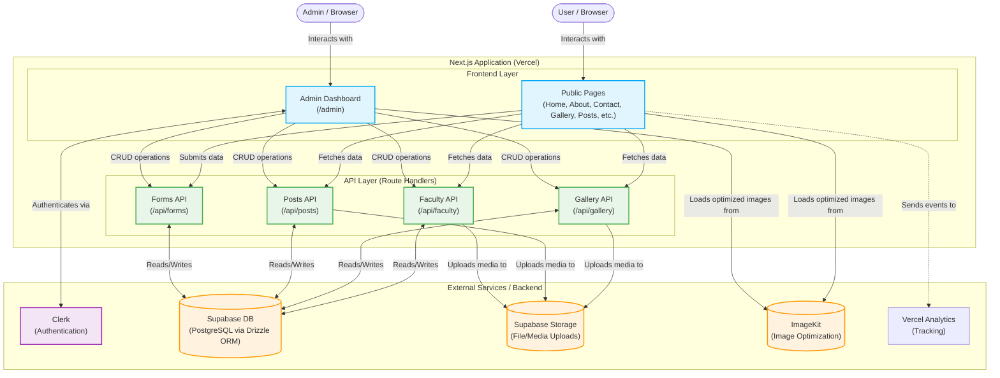

# System Architecture

Here is the high-level system architecture for the Svcdalauda website.

## Key Technologies

- **Frontend & API**: Next.js 16 (App Router), React 19, Tailwind CSS
- **Authentication**: Clerk
- **Database**: Supabase (PostgreSQL) managed with Drizzle ORM
- **Storage**: Supabase Storage for files and ImageKit for image optimization
- **Internationalization**: Intlayer
- **Components**: Radix UI, Shadcn UI
