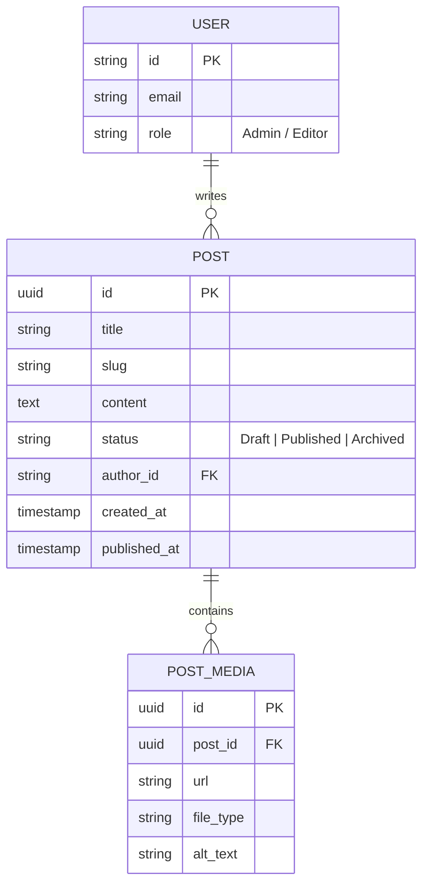
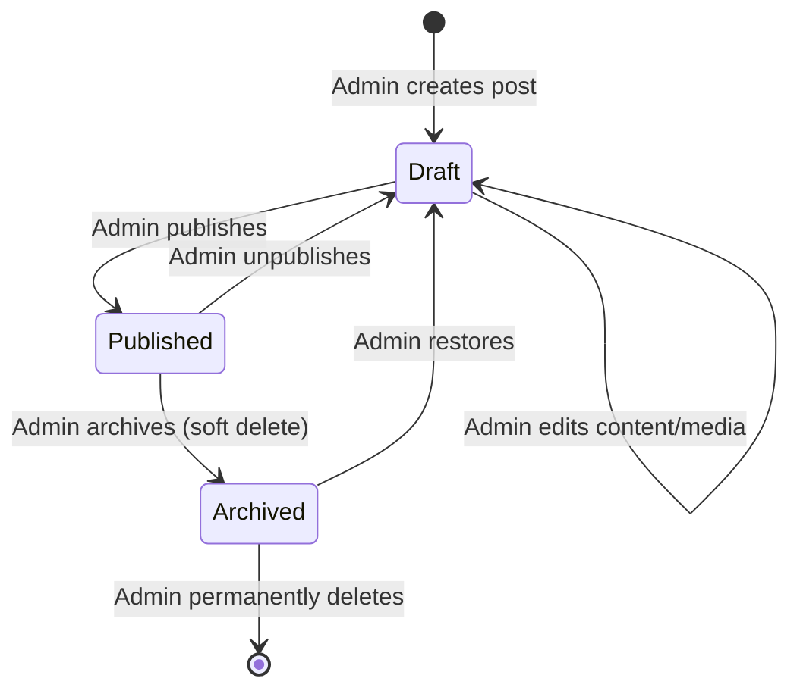
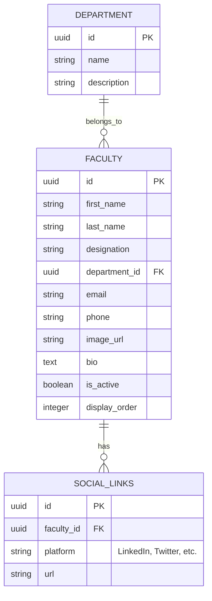
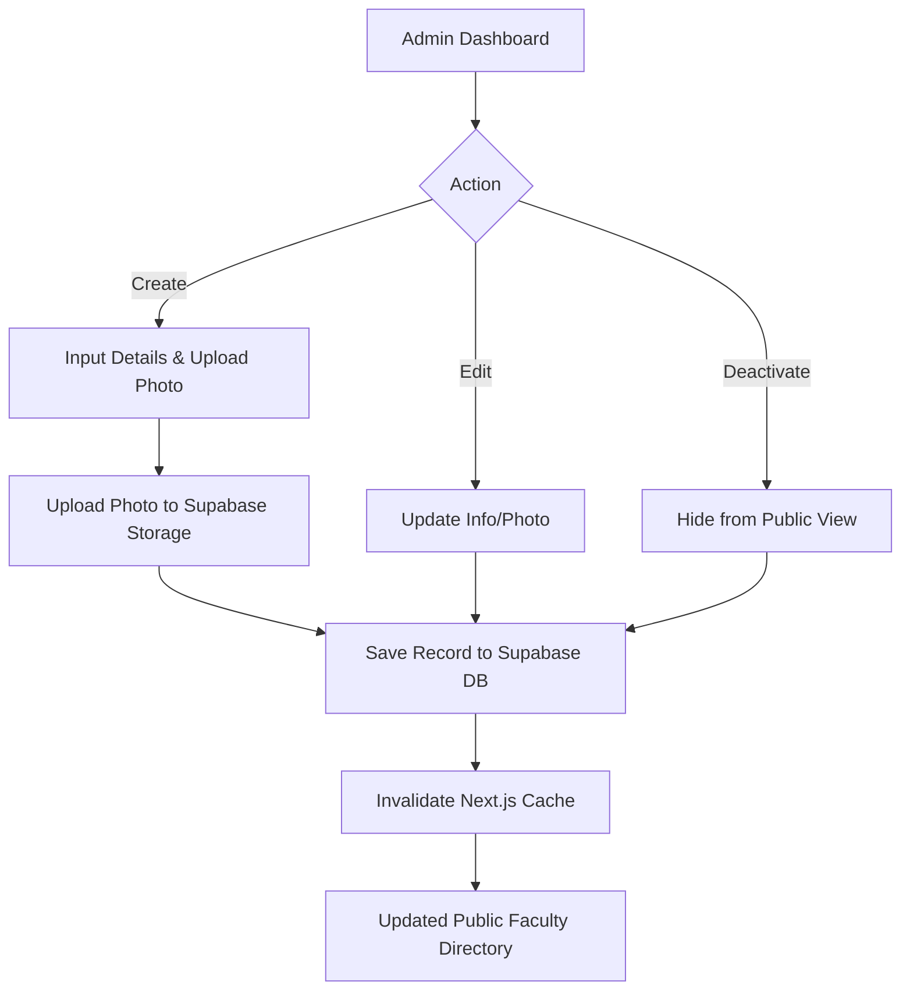
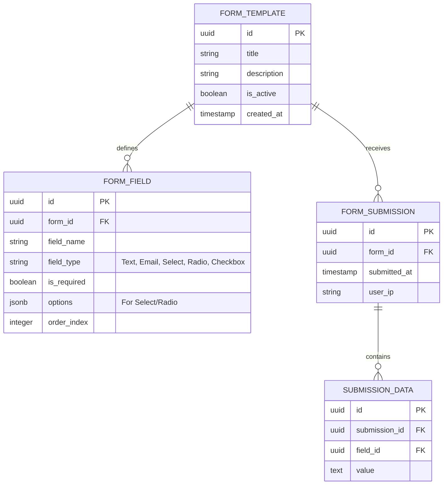
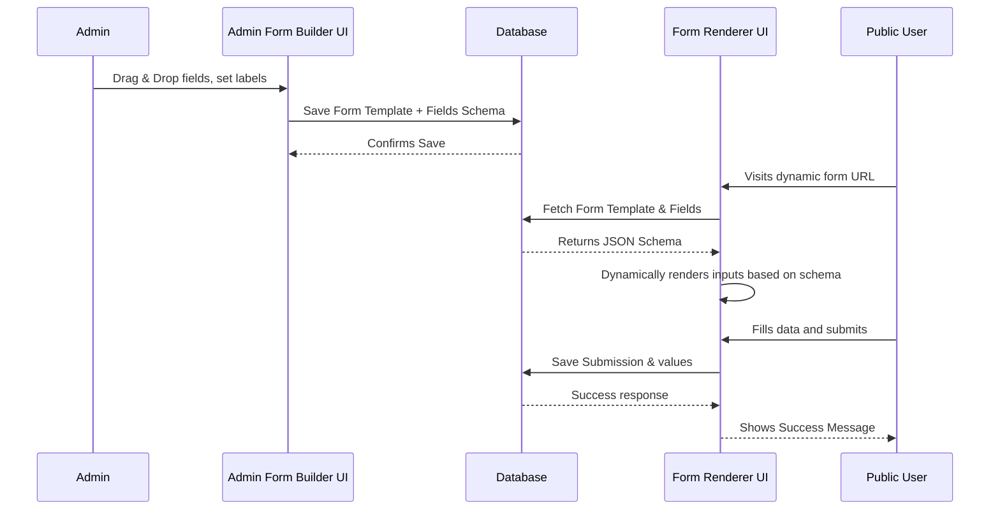

# Subsystems Architecture

This document breaks down the specific architectures and data models for the three core administrative modules: the Content Management System, Faculty Management System, and Form Builder.

## 1. Content Management System (CMS)

The CMS handles the creation, management, and publishing of dynamic content like news, announcements, and posts.

### CMS Data Model (ERD)

### Content Publishing Lifecycle (State Diagram)

---

## 2. Faculty Management System

This module manages the directory of faculty and staff members, making it easy to maintain an up-to-date staff roster.

### Faculty Data Model (ERD)

### Faculty Management Workflow

---

## 3. Dynamic Form Builder

The Form Builder allows administrators to create custom forms (e.g., event registration, contact forms, surveys) and collect user responses dynamically without touching code.

### Form Builder Data Model (ERD)

### Form Builder Engine Data Flow

