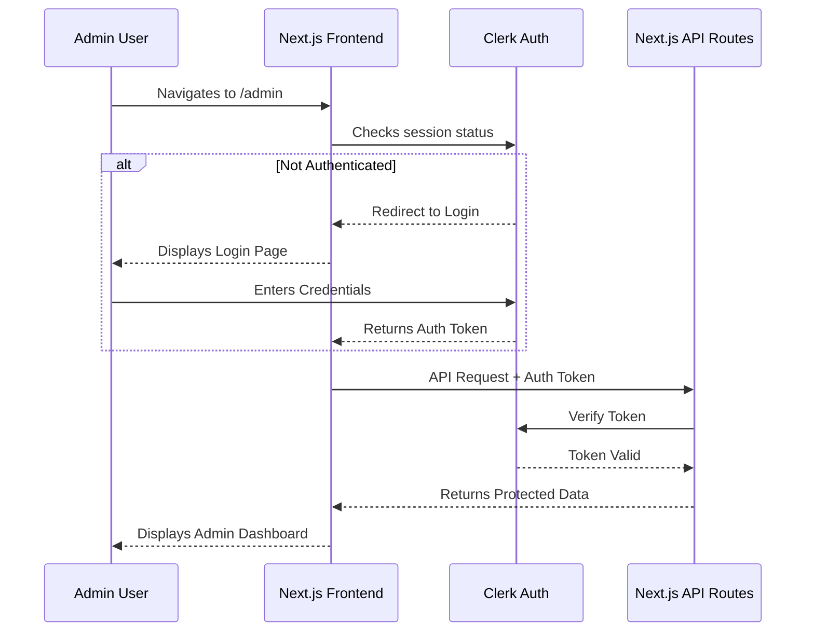
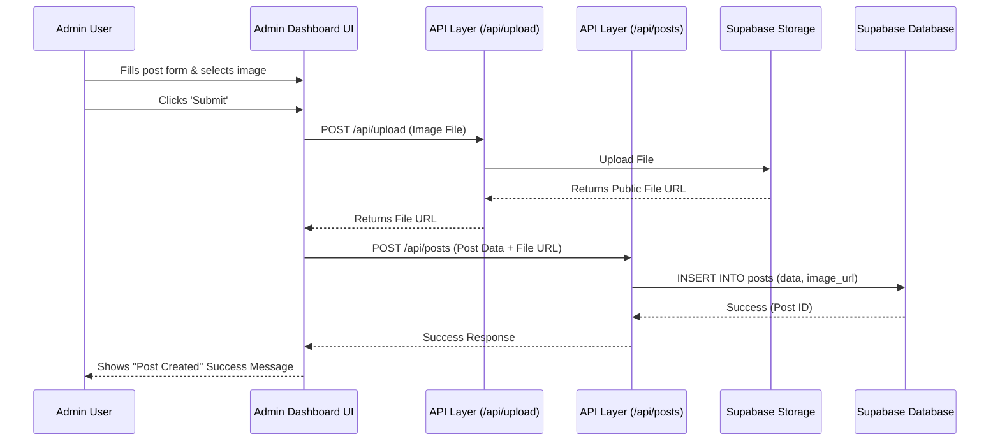
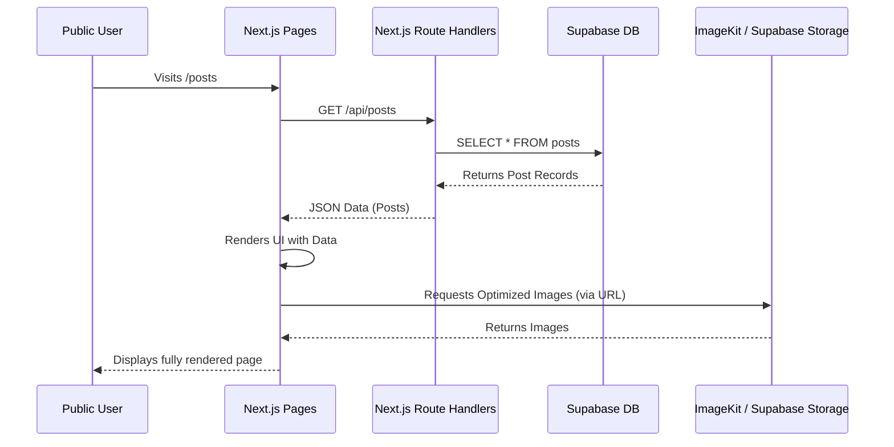
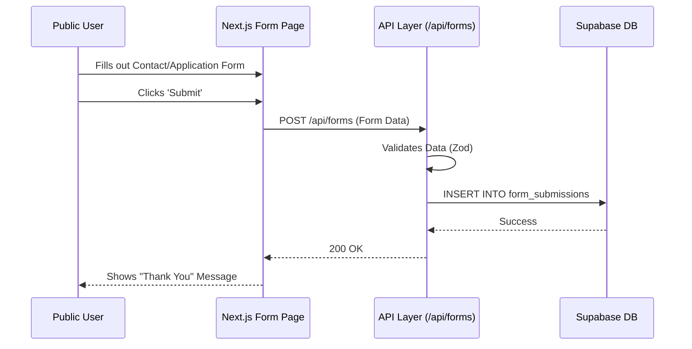

# Workflows and Data Flow

This document outlines the primary data flows and workflows within the application.

## 1. Authentication Workflow (Admin)

## 2. File Upload & Post Creation Workflow (Admin)

This workflow describes the process of an administrator creating a new post that includes an image upload.

## 3. Public Data Fetching Workflow

This workflow describes how public visitors view data (like posts or gallery images) on the website.

## 4. Form Submission Workflow (Public User)

